# Github URL : https://github.com/Pushkar-Kulkarni-00/PES1UG24CS350-pes-vcs/edit/main/README.md
# PES-VCS — A Version Control System from Scratch

**Author:** Pushkar S Kulkarni `<PES1UG24CS350>`  
**Platform:** Ubuntu 22.04  
**Language:** C  

A local version control system built from scratch in C, modelled on Git's internal design. Implements content-addressable object storage, a staging area, tree objects, and commit history — all mapped directly to OS and filesystem concepts.

---

## Commands Implemented

```
pes init              Create .pes/ repository structure
pes add <file>...     Stage files (hash + update index)
pes status            Show modified/staged/untracked files
pes commit -m <msg>   Create commit from staged files
pes log               Walk and display commit history
```

---

## Building

```bash
sudo apt update && sudo apt install -y gcc build-essential libssl-dev

make          # Build the pes binary
make all      # Build pes + test binaries
make clean    # Remove all build artifacts
```

Set your author name:

```bash
export PES_AUTHOR="Your Name <PESXUG24CSxxx>"
```

---

## Repository Structure

| File | Role |
|------|------|
| `object.c` | Content-addressable object store (SHA-256) |
| `tree.c` | Tree serialization and recursive construction |
| `index.c` | Staging area (text-based index file) |
| `commit.c` | Commit creation and history traversal |
| `pes.c` | CLI entry point and command dispatch (provided) |
| `pes.h` | Core data structures and constants (provided) |

---

## Phase 1 — Object Storage

**Files:** `object.c`  
**Concepts:** Content-addressable storage, SHA-256 hashing, atomic writes, directory sharding

Every piece of data is stored as an object named by its SHA-256 hash, sharded into `.pes/objects/XX/YYY...` directories.

**Object format on disk:**
```
"<type> <size>\0<data>"
```

**Implemented:**
- `object_write` — builds header + data, computes SHA-256, deduplicates, writes atomically via temp-file + `fsync` + `rename`
- `object_read` — reads file, verifies integrity by recomputing hash, parses header, returns data portion

### Screenshot 1A — All Phase 1 tests passing

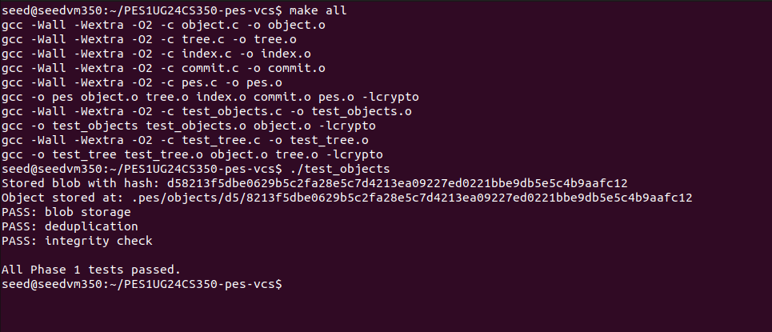

### Screenshot 1B — Sharded object store structure

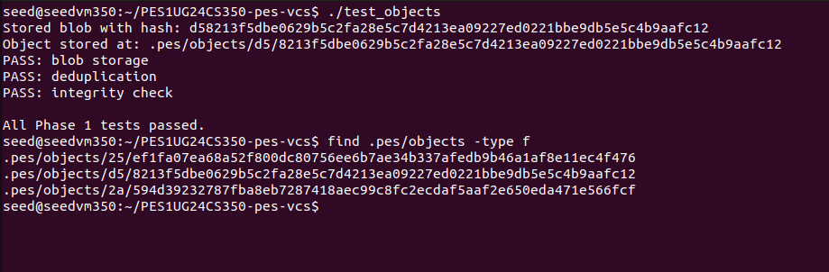

---

## Phase 2 — Tree Objects

**Files:** `tree.c`  
**Concepts:** Directory representation, recursive structures, file modes and permissions

Tree objects represent directory snapshots. Each entry stores a mode, name, and binary hash.

**Binary tree format (per entry):**
```
"<octal-mode> <name>\0<32-byte-binary-hash>"
```

**Implemented:**
- `tree_from_index` — reads the index file, recursively groups entries by directory prefix, writes subtree objects bottom-up, returns root tree hash
- `write_tree_recursive` — recursive helper that handles both flat files and nested subdirectory grouping

### Screenshot 2A — All Phase 2 tests passing

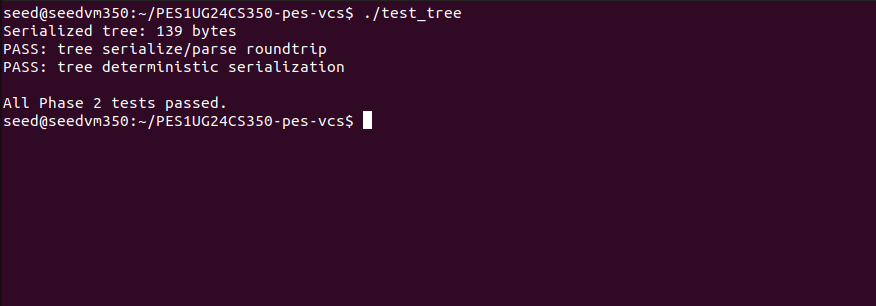

### Screenshot 2B — Raw binary tree object (xxd)

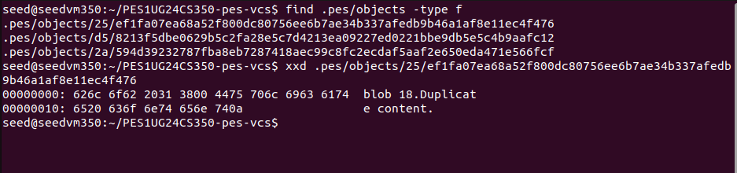

---

## Phase 3 — Index / Staging Area

**Files:** `index.c`  
**Concepts:** File format design, atomic writes, fast change detection via metadata

The index is a human-readable text file tracking staged files:

```
<mode-octal> <64-char-hex-hash> <mtime-seconds> <size> <path>
```

**Implemented:**
- `index_load` — parses `.pes/index` into an `Index` struct; treats missing file as empty index
- `index_save` — heap-allocates sorted copy (avoids ~6MB stack overflow), writes atomically via `qsort` + temp-file + `fsync` + `rename`
- `index_add` — reads file, writes blob, captures `mtime`/`size` via `lstat`, upserts index entry

### Screenshot 3A — `pes init` → `pes add` → `pes status`

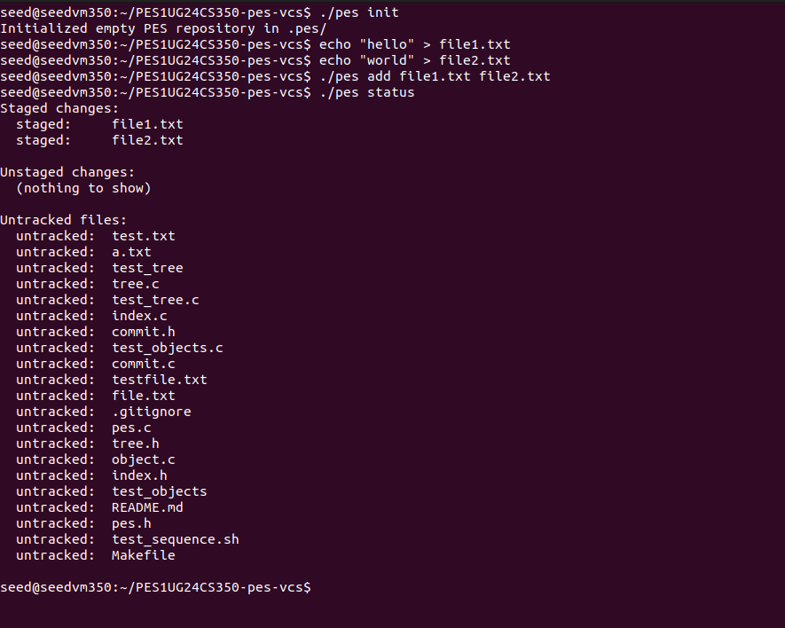

### Screenshot 3B — `cat .pes/index` showing text format

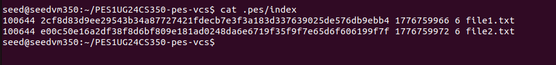

---

## Phase 4 — Commits and History

**Files:** `commit.c`  
**Concepts:** Linked structures on disk, reference files, atomic pointer updates

**Commit text format:**
```
tree <64-char-hex-hash>
parent <64-char-hex-hash>       ← omitted for first commit
author <name> <unix-timestamp>
committer <name> <unix-timestamp>

<commit message>
```

**Implemented:**
- `commit_create` — builds tree from index, reads HEAD for parent, fills `Commit` struct, serializes, writes as `OBJ_COMMIT`, atomically updates branch ref via `head_update`

### Screenshot 4A — `pes log` showing three commits

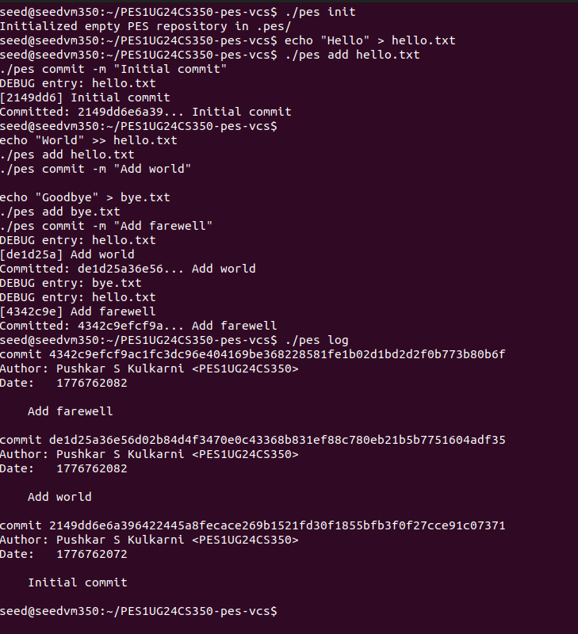

### Screenshot 4B — Object store growth after three commits

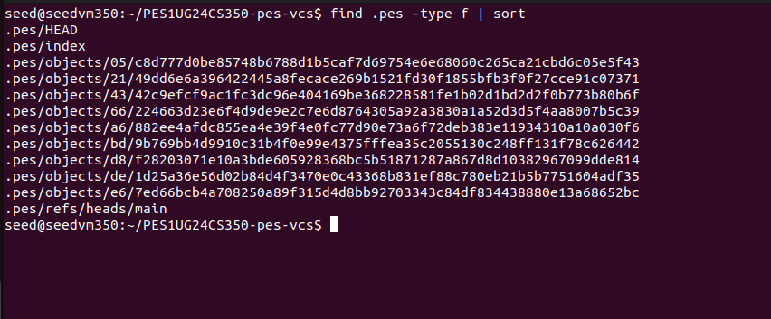

### Screenshot 4C — Reference chain (`HEAD` → `refs/heads/main`)

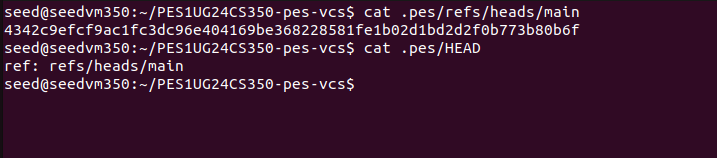

---

## Final Integration Test

Full end-to-end test via `make test-integration` (`test_sequence.sh`):

### Integration Test

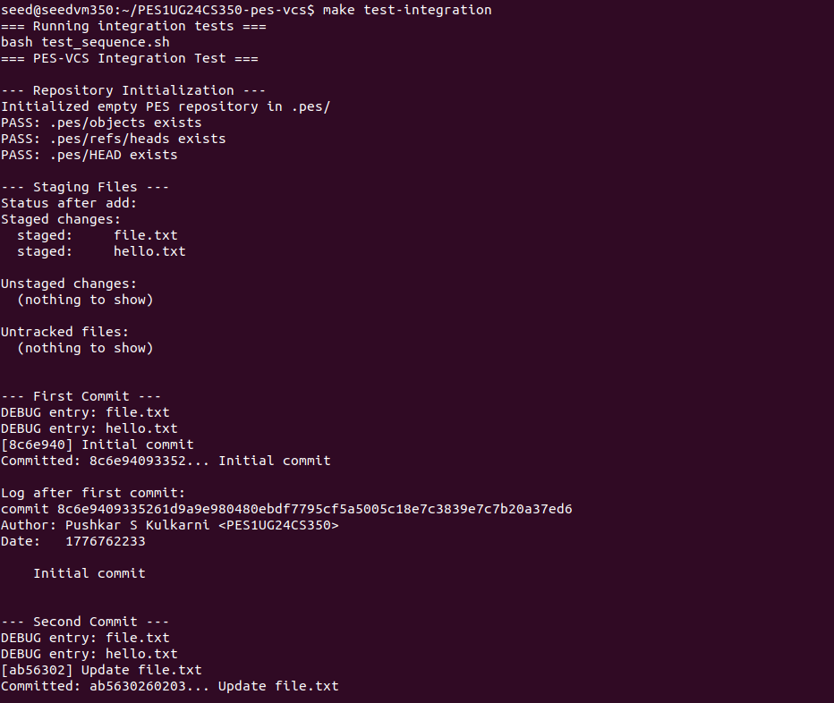
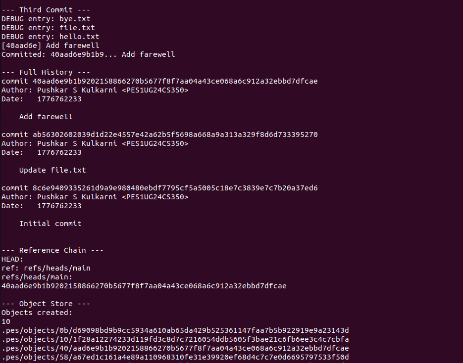
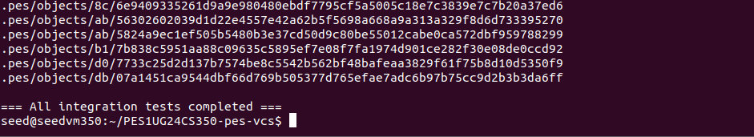

---


## Analysis Questions (Phases 5 & 6)

### Q5.1 — How would `pes checkout <branch>` work?

`HEAD` must be updated to `ref: refs/heads/<branch>`. The working directory must be updated to match the target branch's tree by reading the target commit, walking its tree object, and writing each blob to disk. The complexity comes from handling files that exist in one branch but not the other — they must be created or deleted — and from detecting conflicts with uncommitted changes.

### Q5.2 — Detecting dirty working directory conflicts

For each file in the index, compare its stored `mtime` and `size` against the actual file on disk (`stat`). If they differ, the file has been modified since it was staged. Additionally, compare the staged blob hash against the blob hash in the target branch's tree. If both differ — the file is locally modified AND differs between branches — checkout must refuse.

### Q5.3 — Detached HEAD

In detached HEAD state, `HEAD` contains a raw commit hash instead of `ref: refs/heads/<branch>`. New commits are made but no branch pointer is updated, so they become unreachable once HEAD moves. Recovery: `git branch <newbranch> <hash>` using the hash from `reflog` before it expires, or immediately after noticing the detached state.

### Q6.1 — Garbage Collection Algorithm

Start from all branch refs and HEAD. Do a DFS/BFS over the commit graph: for each commit, mark it reachable, then mark its tree, then recursively mark all blobs and subtrees. Use a `HashSet` of reachable hashes. Then walk all files in `.pes/objects/` — any hash not in the set is unreachable and can be deleted. For 100,000 commits across 50 branches, you'd visit roughly 100,000 commits + their trees and blobs — potentially 500,000–1,000,000 objects total.

### Q6.2 — GC Race Condition

A concurrent commit builds a new tree and blob objects but hasn't yet written the commit object or updated HEAD. GC runs at this moment, sees those blobs as unreachable (no commit points to them yet), and deletes them. The commit then tries to reference deleted objects — the repository is now corrupt. Git avoids this by using a grace period (objects newer than 2 weeks are never collected) and by writing a `FETCH_HEAD`/`gc.pid` lockfile to prevent concurrent GC runs.

---

